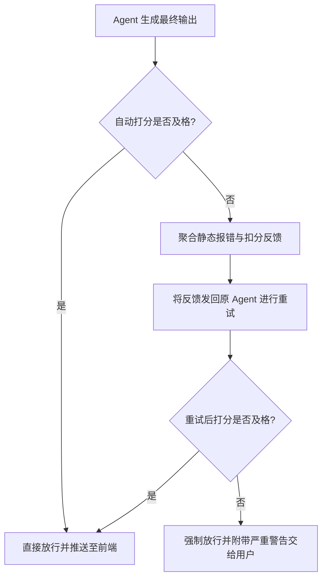

# AgentHub 平台 AI 协作与环境约束规范 (AI Rules)

本文档定义了 AgentHub 平台中，多 Agent 协同工作时的硬性约束条件、代码质量标准以及任务流转的底层规则。平台所有接入的子 Agent（包括自建 Agent）均须严格遵循本规范。

## 一、多 Agent 辩论沙盒规则 (Debate Arena Rules)

当核心意图拦截器判定用户需求为"复杂架构设计"或"存在歧义的核心代码生成"时，系统将强制剥离单 Agent 执行流，触发多 Agent 辩论沙盒。

1. **角色强制对立机制**：沙盒必须并发实例化两个具有绝对对立 System Prompt 的角色（激进派 Proposer 与保守派 Reviewer）。
2. **交互轮次熔断**：为防止模型陷入死循环对抗并消耗过多算力资源，辩论最大轮次强制设定为 `max_turns = 2`。
3. **人类在环裁决 (Human-in-the-loop)**：Agent 无权对辩论结果进行最终合并。沙盒必须输出结构化的争议摘要与独立的代码产物，并全权交由前端用户通过"富媒体对比卡片"进行最终裁决。

## 二、代码质量门禁与反思机制 (Quality Gate & Self-Reflection)

平台引入"LLM-as-a-Judge"模式，对所有生成型 Agent 的产物进行强制拦截与量化打分。

1. **多维度量化评估**：自动评估器需对提取出的代码进行三个维度的打分：逻辑正确性（40分）、代码健壮性与边界处理（30分）、架构合理性（30分）。总分低于 60 分即判定为不及格。
2. **静态语法阻断**：在 LLM 打分前，必须经过 `ast.parse` 等语言原生级别的静态检查。若出现严重语法错误，直接扣除 20 分并阻断后续评估。
3. **带反馈的强制重试 (Self-Reflection)**：若产物不及格，协调器禁止将结果下发给用户。必须将"扣分反馈"与"静态报错信息"作为上下文，注入原 Agent 强制重试。
4. **最大重试限制**：单次任务的最大重试次数设定为 `MAX_RETRIES = 1`。若重试后仍不及格，系统将强制放行，但必须向用户端附加"质量门禁警告"的最高级别状态标识。

## 三、核心调度流转图解

## 四、状态机与上下文隔离约束

1. **特权白名单豁免**：主协调器（`agent_pm`）与部署构建器（`agent_builder`）的输出主要为系统级指令或部署状态流，不属于代码逻辑范畴，默认配置为白名单，跳过上述质量门禁。
2. **上下文污染防护**：若子 Agent 在重试中失败，其产生的所有错误思维链与缺陷代码，禁止合入全局 chatStore 会话上下文，防止对下一轮次的用户交互造成逻辑污染。

## 五、Prompt 分层注入规范 (Layered Prompt Injection)

平台采用 6 层分级 Prompt 注入框架，确保 Agent 行为可控且可追溯：

| 层级 | 名称 | 说明 | 可配置 |
|------|------|------|--------|
| Layer 0 | Identity | 角色身份定义（不可变） | 否 |
| Layer 1 | Capability | 工具能力声明（来自 tool 配置） | 是 |
| Layer 2 | Standard | 质量标准与输出格式 | 是 |
| Layer 3 | Context | 动态上下文（对话历史、任务拆解） | 自动 |
| Layer 4 | Task | 当前任务增强（条件注入） | 自动 |
| Layer 5 | Constraint | 禁止行为（硬性约束，最高优先级） | 否 |

## 六、LLM 接入与容错规范

1. **多 Provider 适配**：统一 LLM 客户端支持 OpenAI 兼容格式、Anthropic 原生格式、Claude Code SDK、OpenCode 四种接入方式。
2. **Mock 降级**：当 API Key 未配置或调用超时时，Agent 自动降级为 Mock 回复，保证平台可用性。
3. **流式输出**：所有 LLM 调用必须采用流式（streaming）模式，前端逐字展示 Agent 回复。
4. **配置持久化**：LLM 配置（Provider、API Key、Base URL、Model）持久化存储，重启不丢失。
